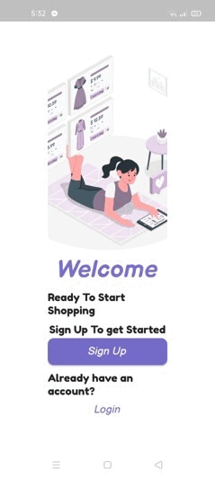

# E-commerce App - iti graduation project

Souq clone.

# Features

-Login and logout and authentication with firebase. 
-Fetching category and products from firestore. 
-Shopping cart. 
-Favourites. 
-Orders. 
-Customizable profile. 
-Dark mode. 
-Contact Us. 

## Packages

* cupertino_icons: ^0.1.3
* provider: ^4.3.2+1
* cloud_firestore: ^0.14.0+2
* firebase_storage: ^4.0.0
* firebase_auth: ^0.18.0+1
* firebase_core: ^0.5.0
* carousel_pro: ^1.0.0
* flutter_material_pickers: ^1.7.2
* bottom_navy_bar: ^5.5.0
* image_picker: ^0.6.7+7
* badges: ^1.1.1
* flutter_slidable: ^0.6.0
* toast: ^0.1.5
* flutter_svg: ^0.19.3
* google_fonts: ^1.1.2

## Screenshots

  

## Getting Started

This project is a starting point for a Flutter application.

A few resources to get you started if this is your first Flutter project:

- [Lab: Write your first Flutter app](https://flutter.dev/docs/get-started/codelab)
- [Cookbook: Useful Flutter samples](https://flutter.dev/docs/cookbook)

For help getting started with Flutter, view our
[online documentation](https://flutter.dev/docs), which offers tutorials,
samples, guidance on mobile development, and a full API reference.
